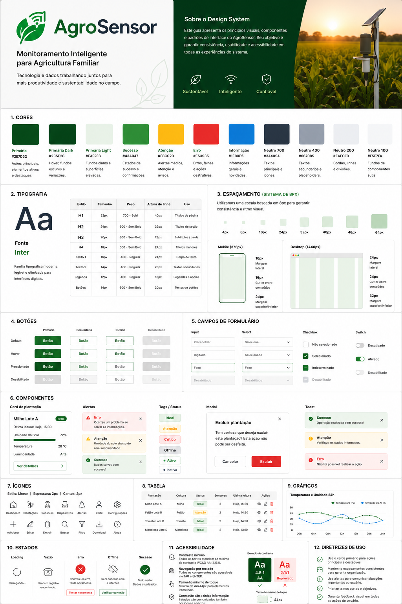

# 🎨 Design UX/UI — AgroSensor

## Visão Geral

Esta pasta reúne os artefatos de UX/UI desenvolvidos para o projeto **AgroSensor**, incluindo o Design System e os protótipos de alta fidelidade da aplicação web.

As interfaces foram projetadas no Figma, permitindo validar os fluxos de navegação, a identidade visual e a experiência do usuário antes da implementação do frontend.

---

## Estrutura da Pasta

```text
design-ux-ui/
├── README.md
├── design-system/
│   └── design-system.png
└── prototipos/
```

---

## Design System

O Design System reúne os padrões visuais adotados no projeto, incluindo:

- Paleta de cores
- Tipografia
- Componentes reutilizáveis
- Botões
- Campos de formulário
- Ícones
- Estados de interação



