# 🎨 Design UX/UI — AgroSensor

## Visão Geral

Esta pasta reúne todos os artefatos de **UX (User Experience)** e **UI (User Interface)** desenvolvidos para o projeto **AgroSensor**.

As interfaces foram prototipadas no **Figma**, permitindo validar a identidade visual, os fluxos de navegação e a experiência do usuário antes da implementação do sistema.

---

# 🎨 Design System

O Design System define a identidade visual do AgroSensor, reunindo:

- Paleta de cores;
- Tipografia;
- Componentes reutilizáveis;
- Botões;
- Campos de formulário;
- Ícones;
- Estados de interação;
- Padronização visual das interfaces.


---

# 🖥️ Protótipos das Interfaces

## 🏠 Tela Inicial

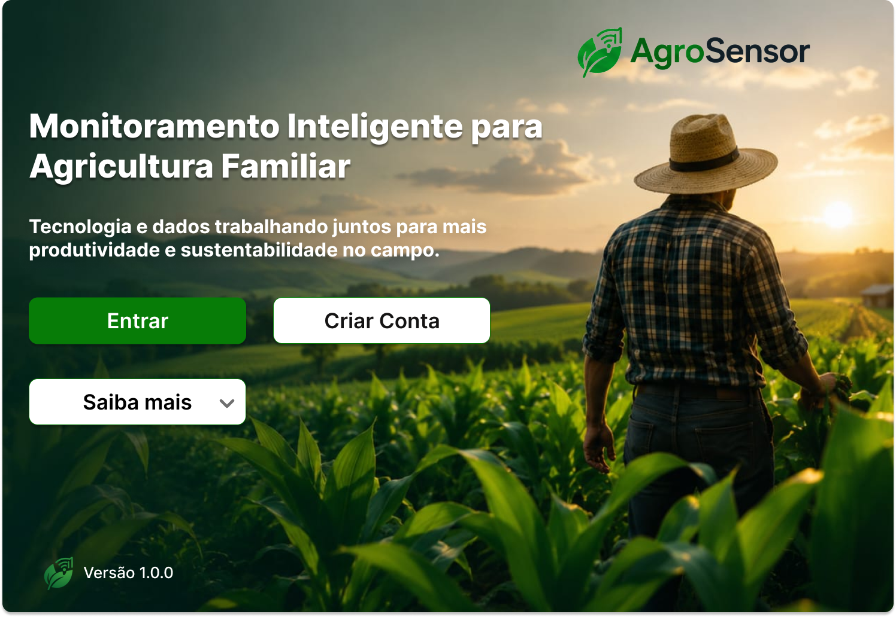

---

## 🔐 Login

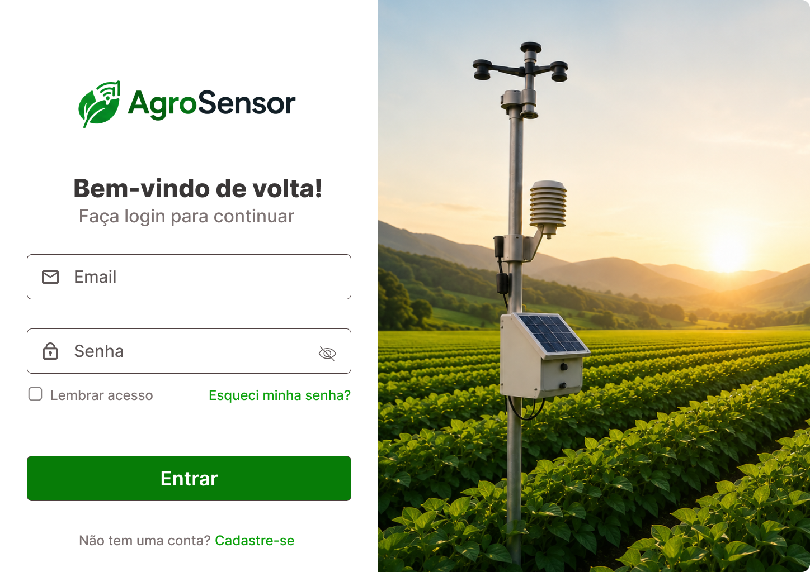

---

## 👤 Cadastro de Conta

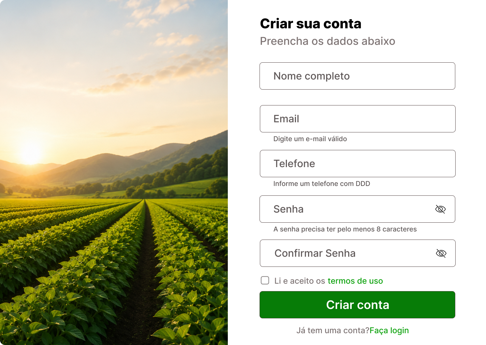

---

## 📊 Dashboard

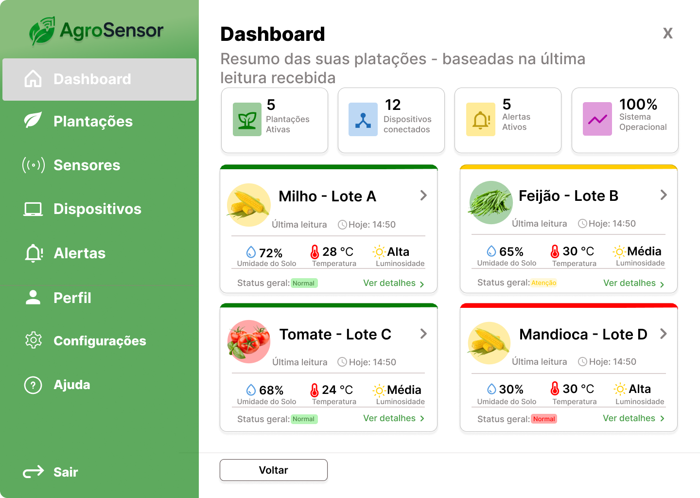

---

## 🌱 Plantações

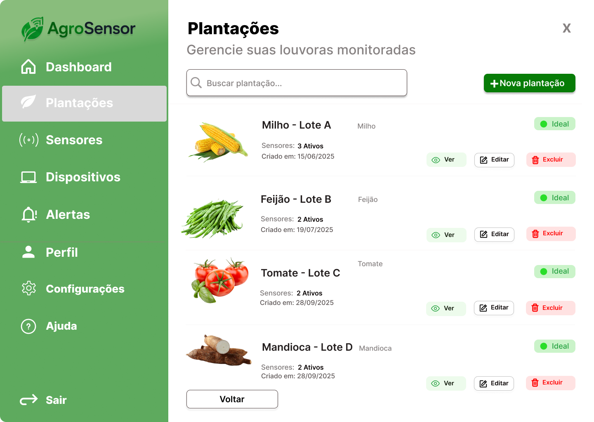

---

## 🌾 Nova Plantação

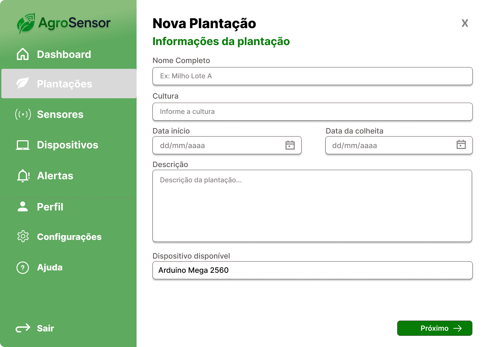

---

## 📋 Detalhes da Plantação

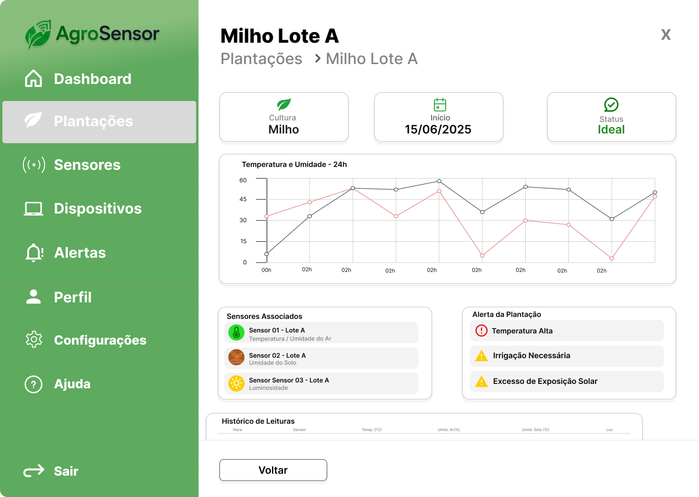

---

## 🌡️ Sensores

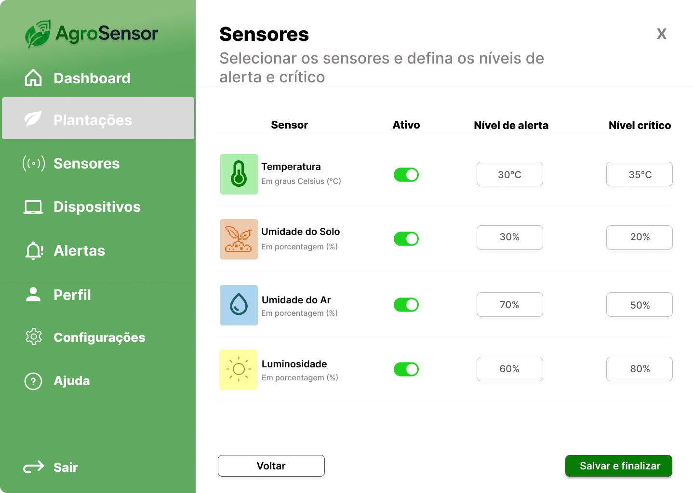

---

## 📡 Dispositivos

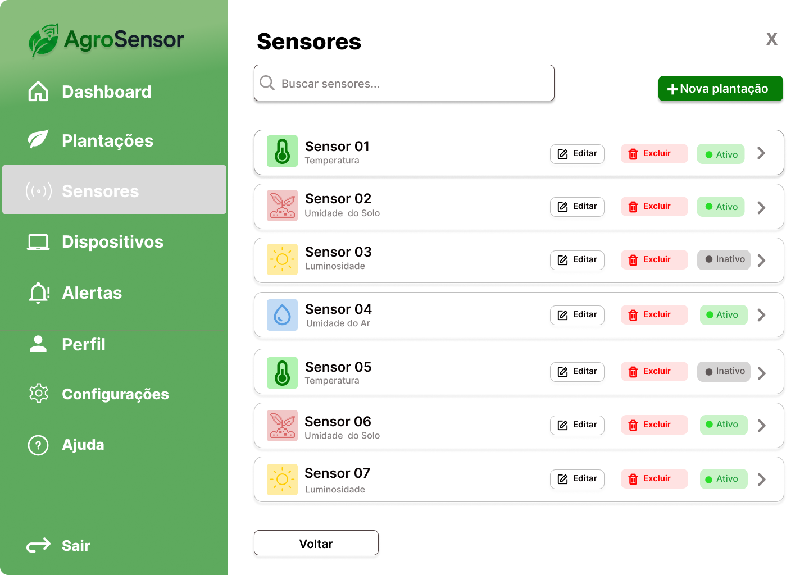

---

## 🚨 Alertas

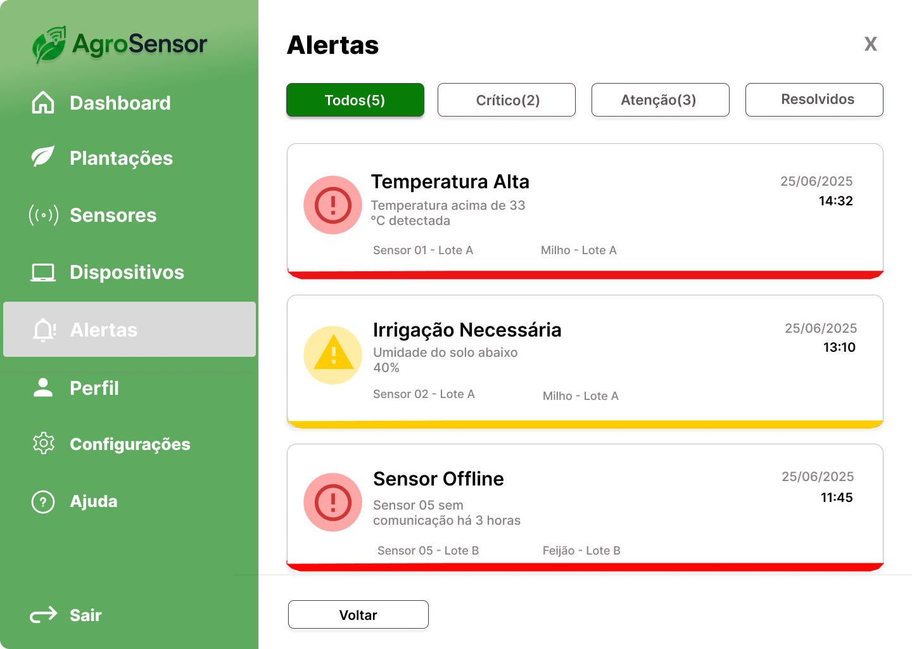

---

## 👤 Perfil

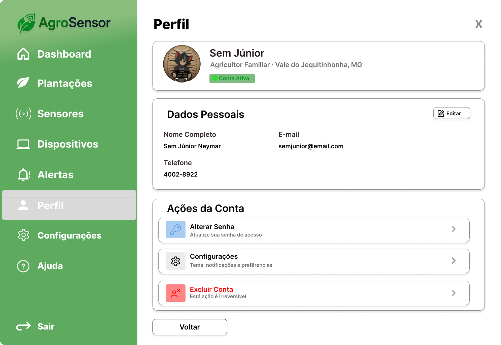

---

## ✏️ Editar Perfil

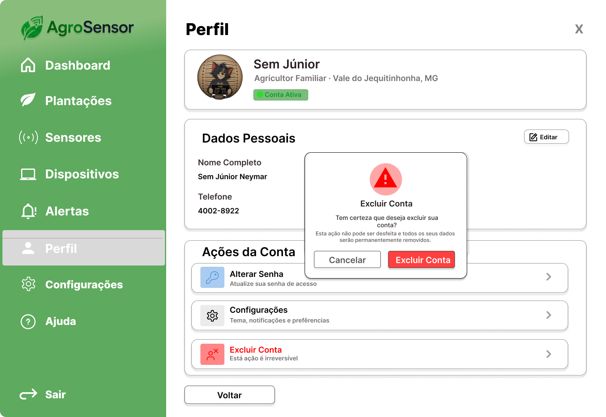

---

## ⚙️ Configurações

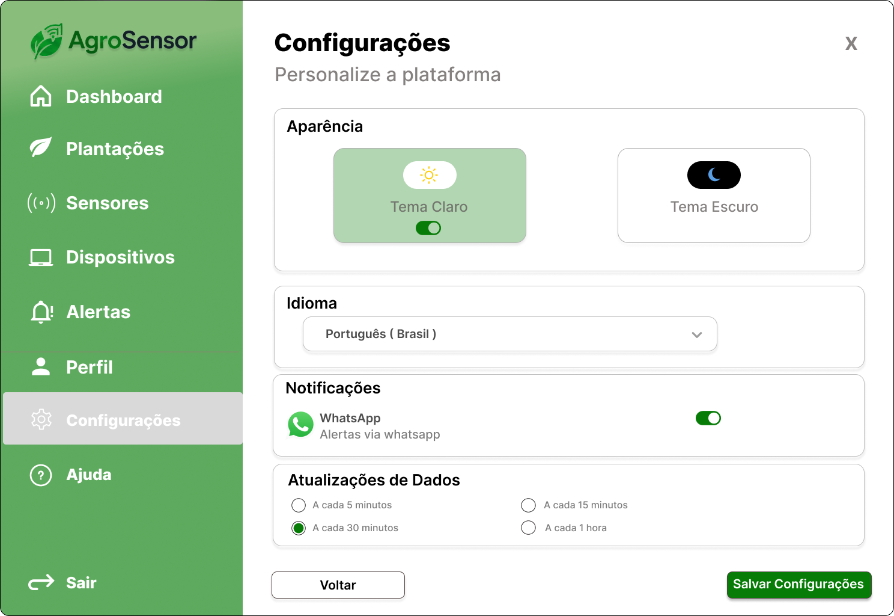

---

## ❓ Ajuda

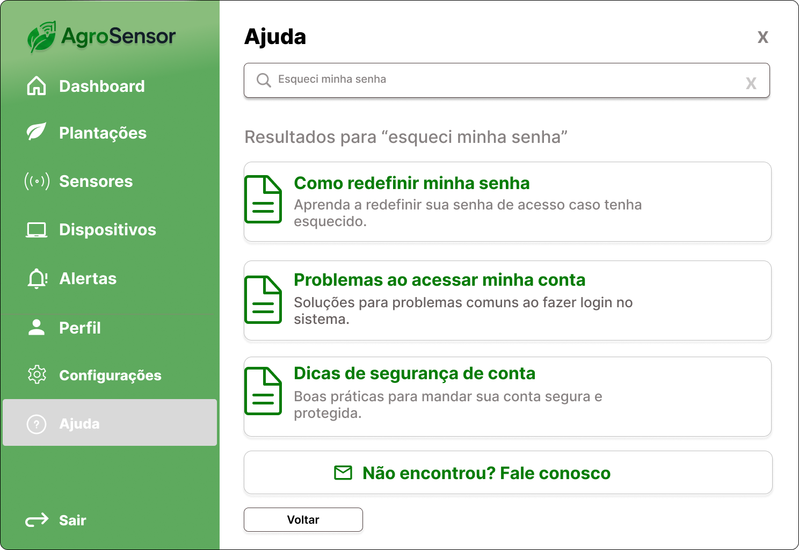

---

# 🛠 Ferramenta Utilizada

Todo o processo de prototipação foi desenvolvido utilizando o **Figma**, possibilitando a criação colaborativa das interfaces e a reutilização dos componentes do Design System.

---

# 🔗 Protótipo Navegável

O protótipo completo pode ser acessado em:

**Figma:**  
*(Cole aqui o link público do Figma.)*

---

# 📁 Estrutura da Pasta

```text
design-ux-ui/
│
├── README.md
│
├── design-system/
│   └── design-system.png
│
└── prototipos/
    ├── 01-tela-inicial.png
    ├── 02-login.png
    ├── 03-cadastro-conta.png
    ├── 04-dashboard.png
    ├── 05-plantacoes.png
    ├── 06-minhas-plantacoes-vazia.png
    ├── 07-nova-plantacao.png
    ├── 08-detalhes-plantacao.png
    ├── 09-sensores.png
    ├── 10-dispositivos.png
    ├── 11-dispositivo-vazio.png
    ├── 12-alertas.png
    ├── 13-perfil.png
    ├── 14-editar-perfil.png
    ├── 15-configuracoes.png
    ├── 16-ajuda.png
    ├── 17-modal-sucesso-plantacao.png
    ├── 18-modal-sucesso-perfil.png
    ├── 19-carregamento.png
    └── 20-erro-aplicacao.png
```

---

# 📖 Sobre os Protótipos

Os protótipos representam o fluxo completo da aplicação web do AgroSensor, contemplando autenticação, gerenciamento de plantações, sensores, dispositivos, alertas e configurações do usuário.

Esses artefatos serviram como base para a implementação da interface e garantiram maior consistência visual e melhor experiência de navegação durante o desenvolvimento do projeto.
